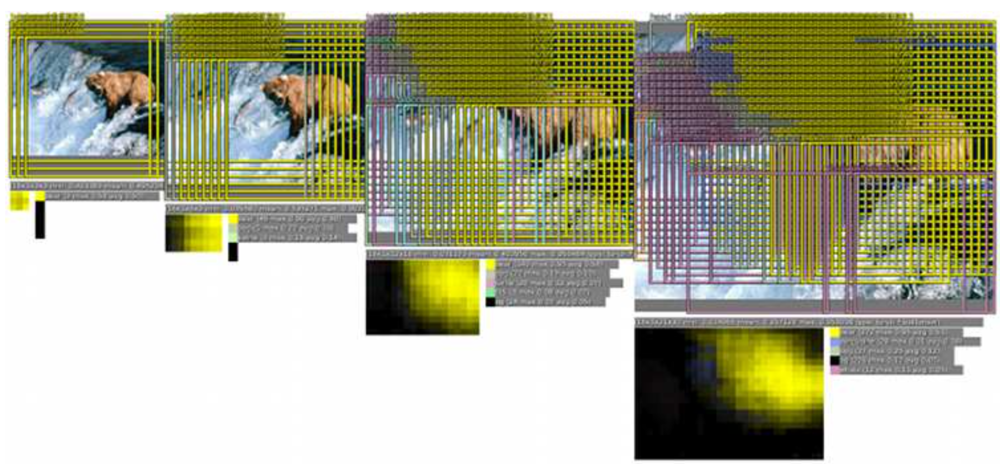
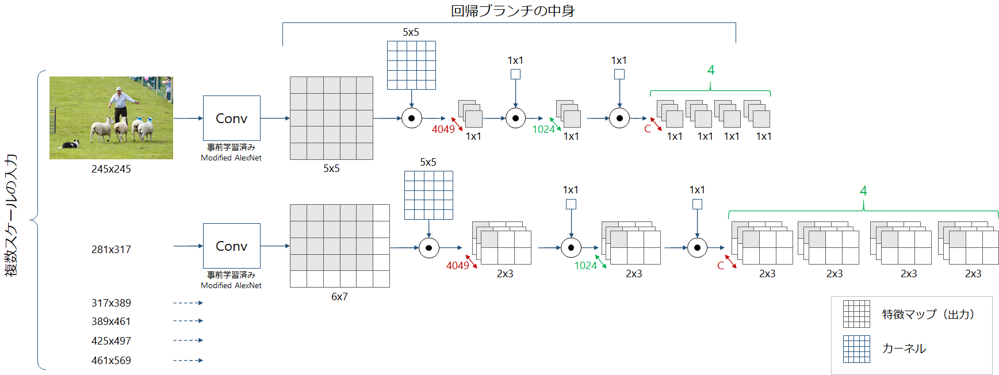

+++
title = "(OverFeat) OverFeat： Integrated Recognition, Localization and Detection using Convolutional Networks, arXiv:2014"
date = 2021-07-25T04:03:55
pubdate = 2013-12-21T09:52:33
category = "paper"
tags = ["Object Detection", "1-stage", "Sliding Window", ]
math = true
draft = false
+++


@misc{sermanet2014overfeat,
      title={OverFeat: Integrated Recognition, Localization and Detection using Convolutional Networks}, 
      author={Pierre Sermanet and David Eigen and Xiang Zhang and Michael Mathieu and Rob Fergus and Yann LeCun},
      year={2014},
      eprint={1312.6229},
      archivePrefix={arXiv},
      primaryClass={cs.CV}
}




従来手法とCNNを組み合わせた初の論文です。R-CNNと似たような位置づけだが、R-CNNは2ステージ検出器、OverFeatは1ステージ検出器の元祖といえると思います。

OverFeatは、CNN for Object Detection最初期の論文ですが、R-CNNが話題に出ることが多く、重要な位置づけの論文の割に日本語の解説ページがあまりないことに気づきました。ほとんど英語の解説記事や解説動画の焼き増し的な記事になると思いますが、日本語解説を用意することに意義があると思いました。

---

# 概要

OverFeatは、物体検出タスクを物体認識タスクと位置推定タスクを統合して実現した、スライディングウィンドウ方式の手法です。

位置推定タスクと物体検出タスクの区別がしっくりと来ませんが、

* 位置推定タスクは、画像中に何か物体があることは保証されていて、どこにその物体があるのかを推定するタスク
* 物体検出タスクは、画像中に物体があることは保証されておらず、何もなければ結果を出力しないような処理が入るもの

だと理解しました。

この論文では、これらを別々のタスクとしてまずは扱い、それらを統合するようなフレームワークになっています。

# OverFeatのフレームワーク

論文本来のフローとかなり流れが違いますが、どうにもわかりにくいので、[Cogneethiの動画](https://www.youtube.com/watch?v=JKTzkcaWfuk)をベースに解説していきます。もち違っている点があれば、ツイッターとかでご指摘ください。

OverFeatのクラス分類・位置推定のブランチは、画像全体のCNNの特徴マップを直接受け取って、最後にそれら２つを統合する処理が入っています。

全体のざっくりした処理フローは、次の図のようになっており、いわゆる領域提案は行わず、1ステージの構造になっています。CNNの部分はAlexNetベースのネットワークになっており、ImageNetで事前に学習済みのものを利用します。

それぞれのモジュールについて解説していきます。

## 分類ブランチ

分類ブランチの中身はFully Convolutional Network(FCN)で構成されており、Conv層のみです。そのため、任意のサイズの入力を受け取ることができます。  
OverFeatは、複数スケールの入力を受け取り、異なるサイズの特徴マップを出力します。すると、Conv層には、受容野があるので、次図の5x5の畳み込みが分類ブランチの一回目で行われれば、特徴の由来の対応関係がグレーのセルのようになります。  
すると、この特徴マップのセルの中に物体があるかどうかを判定できれば、入力画像で粗いスライディングウィンドウをやったのと同じような扱いにすることができます。つまり、スライディングウィンドウのように実際に入力画像を切り出すのではなく、画像全体を入力して、特徴空間で切り出しをしているようなイメージです。空間的な探索空間が大幅に減るので、かなり高速化されます。281x317サイズで画像を入力したときの、2x3の出力で左上のセルに物体があると判定されれば、画像の左上の方にも物体があると解釈することができます。  

## 回帰ブランチ

分類ブランチで、大まかにどこあたりに物体がありそうかというのはわかりますが、かなり解像度があらいので、入力画像上でどの位置にあるのかを求める必要があり、回帰ブランチではそれを行います。  
回帰ブランチの構造は、分類ブランチとほぼ同様です。違うのは、最後の出力サイズくらいです。bboxの座標を表現する4点(x1, y1, x2, y2)を推論するために、マップが4倍になっています。  

### 統合

最後に、分類ブランチと回帰ブランチの出力結果の統合を行います。  
現在よく行われているNMSではなく、貪欲な方法で統合を行っています。  

統合の手順は以下の流れです。

1. 各スケール\\(s \in 1...6 \\)でtop-kのクラス集合を\\(C_s \\)に割当てる。top-kは、各スケールの空間位置を跨いで、計算します。
2. スケール\\(s \\)で、全ての空間位置に対して、クラス集合\\(C_s \\)に対応するクラスのbbox出力を\\(B_s \\)に割り当てる。
3. 各スケールのbbox集合\\(B_s \\)を一つの集合にする。(\\(B \leftarrow \bigcup_{s} B_{s} \\))
4. 各bbox候補をマージしていく。bbox同士のマッチスコアが小さい順からマージして、しきい値を超えると、マージを止める。

`4.` のbbox同士のマッチスコアは、bboxの中心の座標同士の距離を全て計算します。計算した結果の昇順の組み合わせで、マージを実行していきます。マージ後のbboxは、それぞれのbboxの平均になります。

# 感想

言わずもがな、1ステージ検出器の開拓手法として非常に重要な論文ですね。
複数入力必要なのが難点ですが、フォワード計算はかなり高速なのが嬉しい。
一方で、検出性能がR-CNNよりも劣るのが難点。
まあ、スキップコネクションなしで、特徴マップ上でのObjectnessを計算しなきゃいけないのと、
分類ブランチの学習がマルチスケールに対応できていないような気がするので、推論時にギャップが生じている気がする。

# 参考

* [C 5.6 Overfeat , Network Design Important-Dont skip, CNN, Object Detection , EvODN](https://www.youtube.com/watch?v=JKTzkcaWfuk)
* [OverFeat , Lecture 38 (Part 1) , Applied Deep Learning](https://www.youtube.com/watch?v=4DNxgPYKJdA)
* [Overfeat Review(1312.6229)](https://towardsdatascience.com/overfeat-review-1312-6229-4fd925f3739f)
