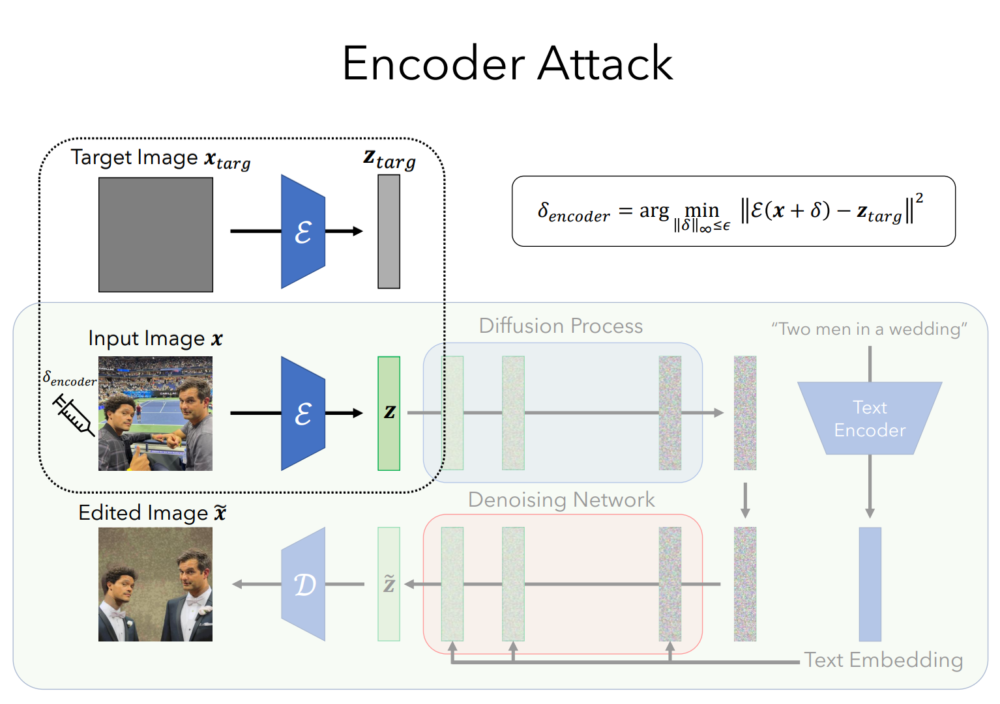
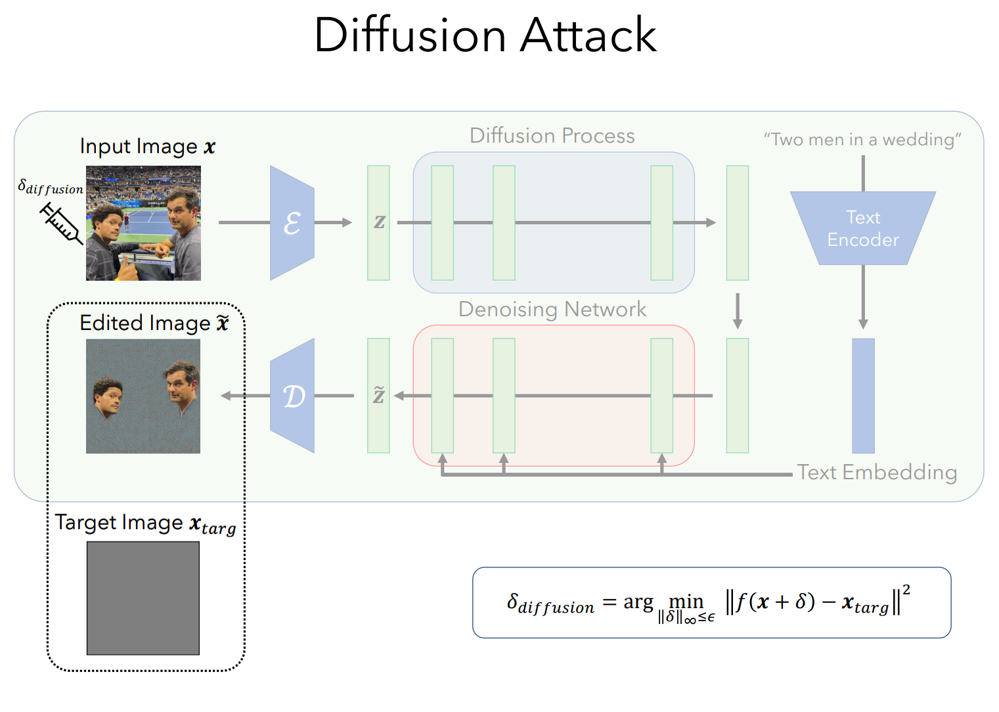
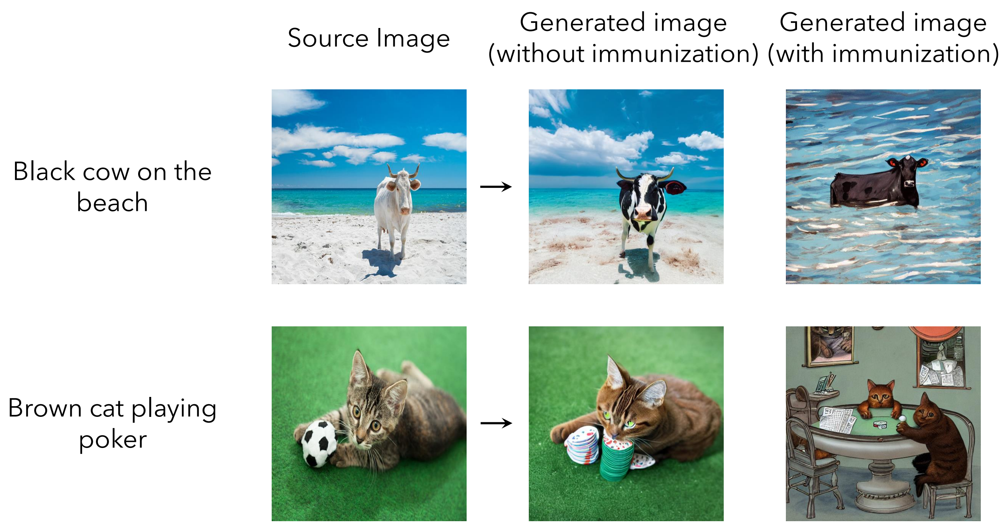
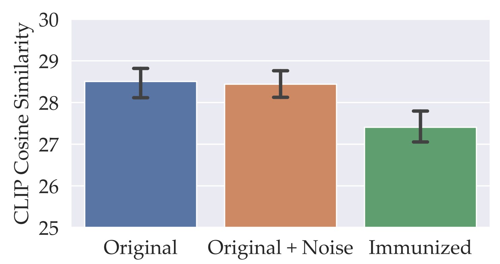

+++
title = 'PhotoGuard'
date = 2023-10-01T21:11:56
pubdate = 2023-02-02
tags = ["ICML", "Adversarial Examples", "Diffusion Model", "Art"]
+++



@InProceedings{pmlr-v202-salman23a,
  title = 	 {Raising the Cost of Malicious AI-Powered Image Editing},
  author =       {Salman, Hadi and Khaddaj, Alaa and Leclerc, Guillaume and Ilyas, Andrew and Madry, Aleksander},
  booktitle = 	 {Proceedings of the 40th International Conference on Machine Learning},
  pages = 	 {29894--29918},
  year = 	 {2023},
  editor = 	 {Krause, Andreas and Brunskill, Emma and Cho, Kyunghyun and Engelhardt, Barbara and Sabato, Sivan and Scarlett, Jonathan},
  volume = 	 {202},
  series = 	 {Proceedings of Machine Learning Research},
  month = 	 {Jul},
  publisher =    {PMLR},
  pdf = 	 {https://proceedings.mlr.press/v202/salman23a/salman23a.pdf},
  url = 	 {https://proceedings.mlr.press/v202/salman23a.html},
  abstract = 	 {We present an approach to mitigating the risks of malicious image editing posed by large diffusion models. The key idea is to immunize images so as to make them resistant to manipulation by these models. This immunization relies on injection of imperceptible adversarial perturbations designed to disrupt the operation of the targeted diffusion models, forcing them to generate unrealistic images. We provide two methods for crafting such perturbations, and then demonstrate their efficacy. Finally, we discuss a policy component necessary to make our approach fully effective and practical—one that involves the organizations developing diffusion models, rather than individual users, to implement (and support) the immunization process.}
}




-----------

悪意あるユーザによる画像編集を防ぐPhotoGuardを提案。フェイクニュースを防ぐことが目的。 
摂動を加えて、AIによる画像編集コストを上げる。（この論文では予防接種と呼んでいる）

## PhotoGuard

攻撃方法（予防方法）は次の2種類。





### Encoder Attack

LDMのImage Encoder $\mathbf{\epsilon}$ に対してPGD攻撃する。 
--> 悪いRepresentationを生成する。

　アーティファクトは発生しているが、目的の男性は生成できてしまっている。 
　テキストを無視できていない。 
　中間表現を攻撃しているだけ。生成結果の保証がない。 
--> Diffusion Attack

### Diffusion Attack

最終的に生成された画像が失敗するようなPGD攻撃を行う。

## 結果

対象モデル＝Stable Diffusion v1.5
目標＝無関係な画像の生成 or 非写実的な画像の生成

