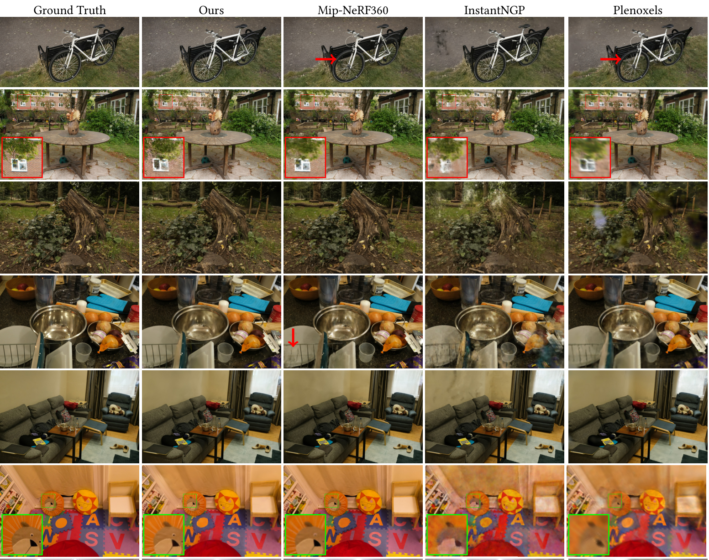
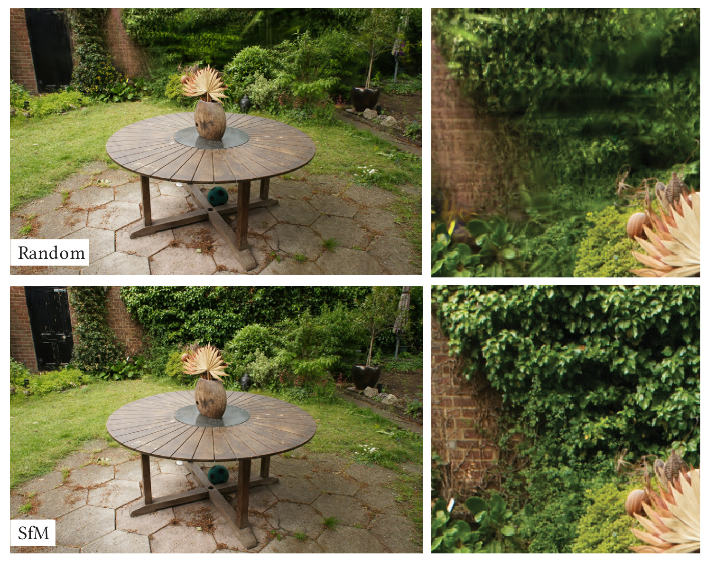

+++
title = '3D Gaussian Splatting'
date = 2023-11-13T12:53:11
pubdate = 2023-03-01T00:00:00
tags = ["rendering", "neural rendering", "3D Gaussian Splatting", ]
+++


@Article{kerbl3Dgaussians,
      author       = {Kerbl, Bernhard and Kopanas, Georgios and Leimkhler, Thomas and Drettakis, George},
      title        = {3D Gaussian Splatting for Real-Time Radiance Field Rendering},
      journal      = {ACM Transactions on Graphics},
      number       = {4},
      volume       = {42},
      month        = {July},
      year         = {2023},
      url          = {https://repo-sam.inria.fr/fungraph/3d-gaussian-splatting/}
}




高解像度(1080p)で学習時間が短く、描画時間もリアルタイム（>=30fps）であるようなレンダリング手法を提案する。

1. カメラキャリブレーションから生成されるスパースな点から3Dガウシアンを使ってシーンを表現する。この3Dガウシアンはシーンを最適化する連続的なボリューム輝度場を持ちながら、空のスペースに対しては不要な計算を行わないという理想的な性質を持つ。
2. 3Dガウシアンのインタリーブ最適化と密度制御を行い、異方性共分散を最適化することでシーンを正確に表現する。
3. Visibility-Awareな高速レンダリングを行う。異方性スプラフティングをサポートし、学習の高速化＆リアルタイムレンダリングを可能にする。

-----------

NeRFやその派生系(voxel, hash grids, points)のVolumetric Ray-Marchingを使った方法は連続値を扱えるので最適化しやすいが、サンプリングに時間がかかったり、ノイジーになりやすいデメリットがある。

この論文のゴール

* 複数のシーン画像からのリアルタイムレンダリング
* 既存手法よりも数倍速い最適化

## 3D Gaussian Splatting

SfMのスパースな点群を出発点として、高解像度な新規視点のシーンを最適化する必要があり、それには微分可能なボリュームレンダリングの性質を持ちつつ、高速なレンダリングができるプリミティブが必要。
3D Gaussianはそういった性質を持つし、アルファブレンディングできる2D上に投影することができる。

3D Gaussianに近い論文＝[小さな法線をもつ円盤を使う](https://repo-sam.inria.fr/fungraph/differentiable-multi-view/)  
しかし、これは法線を推定するのが困難で、それを最適化するのも難しい。

3D Gaussianは世界座標系で中心点（平均） $\mu$ の3次元共分散行列 $\Sigma$ で定義される。

$$
G(x)=e^{-\frac{1}{2}(x)^T \Sigma^{-1}(x)}
$$

このガウシアンは$\alpha$を掛けることでブレンディングできる。

3Dから2Dにレンダリングするときは、次式で行える。

$$
\Sigma^\prime = JW\Sigma W^TJ^T
$$

ここで、J＝透視投影変換のアフィン近似のヤコビアン、W＝視点変換行列、$\Sigma^\prime$＝カメラ座標系の共分散行列。

この3D Gaussianの3次元共分散行列 $\Sigma$を直接最適化できれば良いが、共分散行列は半正定値のときのみ物理的な意味を持つのでうまく行かない。制約を設けて勾配降下法をしてもうまく行かない。
純粋な共分散行列を最適化しようとしてもだめなので、3D Gaussianを楕円体とみて共分散行列っぽいものを作ってみる。

$$
\Sigma = RSS^TR^T
$$

ここで、R＝回転行列、S＝スケール行列。このRとSを両方最適化したいがうまくいかないので、別々に最適化する。
（自動微分のオーバーヘッドを避けるために、明示的に手計算で微分している模様...）

### 3D Gaussianの適応的密度制御による最適化

#### 最適化

3D Gaussianの  
密度  
\+ 位置  
\+ 透明度 $\alpha$  
\+ 共分散行列 $\Sigma$  
\+ 球面調和係数（各Gaussianの色）

の最適化を行う。

反復的なレンダリングで生成された画像と学習画像とを比較して最適化を行う。しかし、3D->2Dの投影は曖昧さを含み不確実性が伴う。
そのため、まず幾何情報を作成して、間違っていたら削除したり動かしたりできるような最適化を行う。

GPUアクセラレートフレームワークやカスタムCUDAカーネルを追加して高速化を図っている。後述の高速なラスタライズも重要。

$\alpha$に対してはsigmoid関数を適用して\[0, 1\)になるようにしたり、勾配がなめらかになるようにしている。また、指数関数的な活性化関数は共分散行列のスケールするのに使っている。

初期の共分散行列は近傍の3点への距離平均に等しい軸を持つ等方性のガウシアン。
Plenoxelsと同様に指数的減衰スケジューラを使用するが、「位置」のみに適用。
損失関数としては次式になる。これを確率的勾配降下法(SGD)で最適化。

$$
\mathcal{L}=(1-\lambda) \mathcal{L}_1+\lambda \mathcal{L}_S
$$

ここで、$\lambda=0.2$

#### 適応的なガウシアンの制御

SfMのスパースな点群を初期位置として、適応的にガウシアンの数や単位ボリューム（ガウシアンではなく、その場所の密度という意味だと思う）の密度を制御する。

Warm-up最適化をしたあと、100イテレーションごとに密にして、$\alpha$がしきい値$\epsilon_{\alpha}$を下回ったら削除する。

ガウシアンの適応的な制御は空のスペースに配置する必要がある。
これは、幾何学的な特徴が欠落している領域に焦点を当てるだけではなく、ガウシアンがカバーするシーンの大きな領域の両方に焦点を当てている。（意味がよくわからない）

最適化をしていくと入力カメラ付近にfloater（ホコリみたいなやつ）が積層していくので、N=3000イテレーションごとに$\alpha$を0に近づける。
他にも大きすぎるガウシアンは排除する。

### 高速な微分可能なガウシアンのラスタライズ

目標＝高速なレンダリング＋高速なソート  
$\rightarrow$ $\alpha$ブレンディングをやったり、スプラットの回数制限を避けるため  
$\rightarrow$タイルベースのラスタライズ＝プリミティブを画像全体に対して事前にソートして、ピクセルごとにソートを行う計算量を避ける [ref](https://openaccess.thecvf.com/content/CVPR2021/html/Lassner_Pulsar_Efficient_Sphere-Based_Neural_Rendering_CVPR_2021_paper.html)

このラスタライズは任意の数の混合ガウシアンに対して効率的なバックプロパゲーションを行え、メモリ消費量が少ない。（ピクセルごとのオーバーヘッドが必要なだけ）

1. 画面を$16 \times 16$のタイルに分割して、ビューの台形（frustum）に応じて3Dガウシアンをタイルごとに間引く。信頼区間99%のガウシアンだけ残す。
さらに、ガードバンドを設けてFrustumから近すぎたり、遠すぎたりするものを棄却する。（投影される二次元共分散の計算が不安定になりがちだから）
2. タイルの重なりに応じてガウシアンをインスタンス化、その後深度とタイルIDを組み合わせてインスタンスにキーを割り当てる。
3. ガウシアンをキーに応じてソート（single fast GPU Radix sortを使う）

このソートに基づいて$\alpha$ブレンディングが行われる。  
はじめの方は$\alpha$ブレンディングはいくつかの構成の近似として動作するが、スプラットがピクセルサイズに近づくにつれてこの近似は無視できるようになっていく。

タイルにスプラットされ、深度でソートされたリストを生成し、タイルごとにラスタライズするためのスレッドブロックを起動しておく。各スレッドブロックは共有メモリにガウシアンパケットをロードして、各ピクセルに色と$\alpha$をfront-to-back方向に累積していく。$\alpha$値が飽和したらそのスレッドを停止させる。定期的にタイルのスレッドをチェックして、全ピクセルが飽和していたらスレッド全てを停止する。  
先行研究と異なり、勾配を受け取るプリミティブの数を制限してない。（シーン固有のハイパーパラメータが不要という意味）

### 結果

Mildenhallの研究で使われた13つのリアルなシーンで実験。

Mip-NeRF360は48hかかるが、3D Gaussian Splattingは35-45minで学習できる。
InstantNGPやPlenoxelsは5-10minで終わるが、品質は劣る。

#### Ablations

### Limitations

* 観測シーンが少ない場合はアーチファクトが発生
* 細長いアーチファクトやポツポツとした3Dガウシアンを作成する可能性がある
  
* 大きなガウシアンが作られた場合にポッピングアーチファクト（LODの切り替えタイミングで起こるアーチファクト）が時々発生 [ポッピングのイメージ](https://www.cg.tuwien.ac.at/research/vr/unpopping/examples/examples/examples_interactive/popping_examples/index.html)
  * 視点位置依存のアピアランスの影響で発生するのでは
  * ラスタライザのガードバンドにより棄却されてしまうのでは
* 単純な実装だと20GBくらい使うが、低レベル実装したら学習に数百MB、ラスタライズには追加で30-500MBくらいで済む（解像度依存）。

