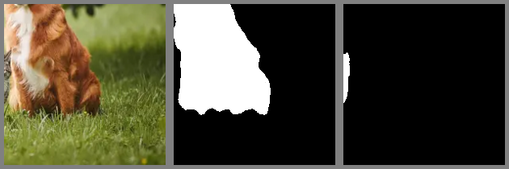
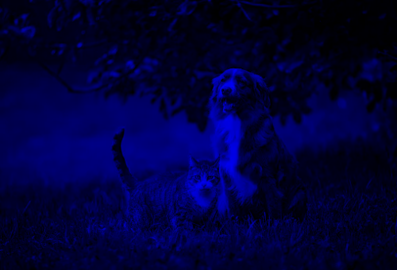

+++
title = 'Albumentationsにおける自作変換クラス作成'
date = 2024-06-13T23:06:34
pubdate = 2024-06-12T23:06:34
tags = ['Python', 'Albumentations', 'Data Augmentation']
draft = true
outline = true
+++




-----------

なんだかものすごく久しぶりの投稿ですが、今回はAlbumentationsにおける自作変換クラス作成について書いていきます。

画像変換するとき、Albumentationsって便利ですよね。なんといっても変換できる種類の数が豊富なのが嬉しいです。  
ただ、自分で新たに変換クラスを作成しようとすると、ドキュメントが豊富とは言えないと思うので、誰かの役に立てばと思い、今回の記事を書くことにしました（未来の自分のためかもしれない）。

## 基本的な使い方

### マスク画像を使って画像をクロップする

Albumentationsの基本的な使い方を確認するために、以下のコードを実行してみます。画像とマスクの大きさが中途半端で申し訳ないです。

```python
image = cv2.imread('data/images/dog_and_cat.png') # image.shape: (339, 509, 3)
mask = cv2.imread('data/masks/dog.png', cv2.IMREAD_GRAYSCALE) # mask.shape: (339, 509)

transform = A.Compose([
    A.CropNonEmptyMaskIfExists(height=200, width=200, p=1),
    A.PadIfNeeded(min_height=210, min_width=210, border_mode=cv2.BORDER_CONSTANT, 
                  value=(128, 128, 128), mask_value=128, p=1),
])

transformed = transform(image=image, mask=mask_dog)
grid_image = make_grid_image(transformed.values(), n_cols=2) # 結果の画像をタイル状に並べる
cv2.imwrite('data/results/crop_dog_by_mask.png', grid_image)
```



`make_grid_image`関数は、複数の画像をタイル状に並べる関数です。

```python
def make_grid_image(
    images: Sequence[np.ndarray],
    n_cols: int,
):
    images = [  cv2.cvtColor(image, cv2.COLOR_GRAY2RGB)
                if image.ndim == 2 else image for image in images]
    n_rows = len(images) // n_cols
    h, w, c = images[0].shape
    grid_image = np.zeros((h * n_rows, w * n_cols, c), dtype=np.uint8)
    for i, image in enumerate(images):
        row = i // n_cols
        col = i % n_cols
        grid_image[row * h:(row + 1) * h, col * w:(col + 1) * w] = image
        
    return grid_image
```







ここでは、画像(=image)に犬と猫が写った写真。マスク(=mask)には犬の領域に対応したマスク画像を与えています。
データ変換のパイプラインとしては次の処理を行っています。

1. `A.CropNonEmptyMaskIfExists`でマスクを含むような形で画像を200x200にクロップ
2. `A.Resize`で256x256にリサイズ
3. `A.PadIfNeeded`で外周4ピクセル分をを128でパディング

ご覧の通り、犬の領域に合わせて画像がクロップされていることがわかります。  
imageとmaskが同様に変換されていることが確認できます。  
解像度の関係でわかりにくいかもしれませんが、imageとmaskによってResizeによる補間処理は異なっています。imageの方は、引数通り線形補間が行われますが、maskの方は最近傍補間が行われています。詳しい仕組みは後述します。

`A.Compose`に一連の変換処理をリストで渡すことで、変換処理をパイプラインとして実行できます。  
基本的にAlbumentationsの変換処理のフォーマットはNumpy形式と決まっており、`A.Compose`は、まず初めに入力がそれらの形式になっているのかのチェックやimageとmaskが同じshapeなのかなどのチェックを行います。その後、変換処理を実行していきます。

今回の記事ではRGB画像とマスク画像しか扱いませんが、他にもBBoxやキーポイントなどもいい感じに変換できます。

### マスクが複数になったら

マスクが複数になったら、maskの代わりに各マスクをリストにしたmasksを引数として渡してあげると複数のマスクに同様の変換を適用してくれます。

```python
image = cv2.imread('data/images/dog_and_cat.png') # image.shape: (339, 509, 3)
mask_dog = cv2.imread('data/masks/dog.png', cv2.IMREAD_GRAYSCALE) # mask_dog.shape: (339, 509)
mask_cat = cv2.imread('data/masks/cat.png', cv2.IMREAD_GRAYSCALE) # mask_cat.shape: (339, 509)
transformed = transform(image=image, masks=[mask_dog, mask_cat])

grid_image = make_grid_image([transformed["image"], ] + transformed['masks'], n_cols=3)
cv2.imwrite('data/results/crop_dog_and_cat_by_masks.png', grid_image)
```







`A.CropNonEmptyMaskIfExists`は、複数のマスクがあると、それらのマスク領域の和集合を含むようにしてクロップします。この場合、犬か猫の領域のどちらかを少なくとも含むように、領域をクロップします。

Albumentationsの各変換モジュールがどのターゲット（mask, bbox, keypoint, global_label）に対して作用するのかは、[リファレンス](https://albumentations.ai/docs/api_reference/full_reference/)を見るとわかりやすいです。  
Pixel-levelの変換は、輝度調整や色調変換、ボケやノイズなどの効果をつけたりするものが多く、画像にのみ作用します。  
Spatial-levelの変換は、クロップやリサイズ、パディングや回転などの幾何変換を伴うものが多く、画像以外にもマスクやBBox、キーポイントなどにも作用します。各クラスによって作用するターゲットが異なるので、リファレンスの表を見て確認する必要があります。

## 自作クラスの作成

さて、ここからが本題です。自作の変換クラスを作成してみます。まずは基本的な自作クラスの作成方法を解説します。

### 基本編

Albumentationsでは、主に次の3つのクラスをベースクラスとして自作クラスを作成します。

1. `A.BasicTransform`  
    `A.ImageOnlyTransform`と`A.DualTransform`の基底クラス。  
    色々な変換をするときのパラメータを設定するメソッドを持っています。
2. `A.ImageOnlyTransform`  
    画像のみを変換するときに使う基底クラス。
3. `A.DualTransform`  
    画像とマスクやBBox、キーポイントを同時に変換するときに使う基底クラス

特殊な変換クラスでもない限り、基本的には`A.ImageOnlyTransform`か`A.DualTransform`を継承して作成していくのが一般的だと思います。

#### ImageOnlyTransformを継承したクラス

`A.ImageOnlyTransform`を継承して、画像の特定のチャネルだけ残して他を0にする自作変換クラス`SelectChannel`を作成してみます。

```python
class SelectChannel(A.ImageOnlyTransform):
    def __init__(self, channel: int, always_apply=False, p=1):
        super(SelectChannel, self).__init__(always_apply, p)
        self.channel = channel
    
    def apply(self, image: np.ndarray, **params) -> np.ndarray:
        H, W, C = image.shape
        canvas = np.zeros_like(image)
        canvas[..., self.channel] = image[..., self.channel]
        return canvas
    
    def get_transform_init_args_names(self):
        return ("channel",)
```

このように画像への処理内容は`apply`メソッドに記述します。  
実際に画像に適応してみましょう。青だけ残す処理を行ってみます。OpenCVで読み込んでおり、BGRなので0チャネル目が青です。

```python
transform = A.Compose([
    SelectChannel(channel=0, p=1),
])

image = cv2.imread('data/images/dog_and_cat.png')
transformed = transform(image=image)
cv2.imwrite('data/results/select_b.png', transformed["image"])
```






`apply`メソッドには、`transform(image=image)`で渡されたimageが渡されます。それに対して処理を行って返却すると返り値の辞書の`image`キーに値が格納されます。  
`get_transform_init_args_names`というメソッドは、`A.ReplayCompose`を使うときに必要になるメソッドです。まだ必要ないのですが、後で`A.ReplayCompose`の説明もしたいので、まとめて定義しておきます。

#### DualTransformを継承したクラス1

さて、次はすでにAlbumentationsに入っているのですが、指定した領域をクロップするクラス `Crop`を作成してみます。

```python
class Crop(A.DualTransform):
    def __init__(
        self, 
        x_min: int, 
        y_min: int, 
        x_max: int, 
        y_max: int, 
        always_apply=False, 
        p=1,
    ):
        super(Crop, self).__init__(always_apply, p)
        self.x_min = x_min
        self.y_min = y_min
        self.x_max = x_max
        self.y_max = y_max

    def apply(self, image, **params):
        return image[self.y_min:self.y_max, self.x_min:self.x_max]

    def apply_to_mask(self, mask: np.ndarray, **params) -> np.ndarray:
        return mask[self.y_min:self.y_max, self.x_min:self.x_max]

    def apply_to_masks(self, masks: List[np.ndarray], **params) -> List[np.ndarray]:
        return [mask[self.y_min:self.y_max, self.x_min:self.x_max] for mask in masks]

    def get_transform_init_args_names(self):
        return ("x_min", "y_min", "x_max", "y_max")
```

このクラスは、画像とマスクを同時にクロップする処理を行います。`apply`メソッドは画像に対する処理、`apply_to_mask`メソッドはマスクに対する処理、`apply_to_masks`メソッドは複数のマスクに対する処理を行います。  
`A.DualTransform`では、他にも `apply_to_bbox`、`apply_to_keypoint`、`apply_to_global_label` などがあり、それぞれのターゲットに対してメソッドを定義することができます。  
次のコードで実行結果を見てみましょう。

```python
transform = A.Compose([
    Crop(x_min=100, y_min=100, x_max=300, y_max=300, p=1),
    A.PadIfNeeded(min_height=210, min_width=210, border_mode=cv2.BORDER_CONSTANT, 
                  value=(128, 128, 128), mask_value=128, p=1),
])

image = cv2.imread('data/images/dog_and_cat.png')
mask_dog = cv2.imread('data/masks/dog.png', cv2.IMREAD_GRAYSCALE)
mask_cat = cv2.imread('data/masks/cat.png', cv2.IMREAD_GRAYSCALE)
transformed = transform(image=image, masks=[mask_dog, mask_cat])
grid_image = make_grid_image([transformed["image"],] + transformed['masks'], n_cols=3)
cv2.imwrite('data/results/crop_constant.png', grid_image)
```






`Crop`クラスで指定した領域がクロップされていることが確認できます。


実は、上の変換クラス`Crop`はさらに単純化することができます。`apply_to_mask`と`apply_to_masks`を定義していますが、次のように`apply`メソッドを定義するだけで、maskも同様にクロップされます。imageとmaskは対応したものとして扱われ、同じ変換処理が適用されます。  
そのため、次の`Crop`クラスは上の`Crop`クラスと同じ挙動をします。

```python
class Crop(A.DualTransform):
    def __init__(self, x_min, y_min, x_max, y_max, always_apply=False, p=1):
        super(Crop, self).__init__(always_apply, p)
        self.x_min = x_min
        self.y_min = y_min
        self.x_max = x_max
        self.y_max = y_max

    def apply(self, image, **params):
        return image[self.y_min:self.y_max, self.x_min:self.x_max]

    def get_transform_init_args_names(self):
        return ("x_min", "y_min", "x_max", "y_max")
```

唯一違うのはリサイズなどで補間処理を見つけたら、mask（およびmasks）の場合は最近傍補間が適用されるように自動的に修正されるという点です。  
imageとは異なる処理をしたい場合や可読性を上げたい場合を除けば、`apply` メソッドのみを定義しておけば十分です。


### 応用編

応用編では、より複雑な変換クラスを作成してみます。ただし、ここでは要点のみを説明し、詳細な説明は[仕組み編](#仕組みの解説)に回します。

#### ランダム値を扱いたい

まずは、ランダムなシフトを行う変換クラス`Shift`を作成してみます。

```python
class Shift(A.DualTransform):
    def __init__(
        self, 
        x_shift: Tuple[int, int],
        y_shift: Tuple[int, int],
        always_apply=False, 
        p=1,
    ):
        super().__init__(always_apply, p)
        self.x_shift = x_shift
        self.y_shift = y_shift

    def apply(self, image: np.ndarray, x_shift: int, y_shift: int, **params) -> np.ndarray:
        H, W, *_ = image.shape
        canvas = np.zeros_like(image)
        x_min = max(0, x_shift)
        y_min = max(0, y_shift)
        x_max = min(W, W + x_shift)
        y_max = min(H, H + y_shift)
        
        canvas[y_min:y_max, x_min:x_max] = image[max(0, -y_shift):min(H, H - y_shift), 
                                                 max(0, -x_shift):min(W, W - x_shift)]
        
        return canvas

    def get_transform_init_args_names(self):
        return ("x_shift", "y_shift")
    
    def get_params(self):
        return {
            "x_shift": np.random.randint(*self.x_shift),
            "y_shift": np.random.randint(*self.y_shift),
        }
```


```python
transform = Shift(x_shift=(-100, 100), y_shift=(-100, 100), p=1)

for i in range(2):
    image = cv2.imread('data/images/dog_and_cat.png')
    mask_dog = cv2.imread('data/masks/dog.png', cv2.IMREAD_GRAYSCALE)
    mask_cat = cv2.imread('data/masks/cat.png', cv2.IMREAD_GRAYSCALE)
    transformed = transform(image=image, masks=[mask_dog, mask_cat])
    grid_image = make_grid_image([transformed["image"],] + transformed['masks'], n_cols=3)
    cv2.imwrite(f'data/results/shift_{i:02d}.png', grid_image)
```







あああああーーーー

```python
class RandomCrop(A.DualTransform):
    def __init__(
        self, 
        height: int,
        width: int,
        always_apply=False, 
        p=1,
    ):
        super().__init__(always_apply, p)
        self.height = height
        self.width = width

    def apply(
        self, 
        image: np.ndarray,
        x_min: int,
        y_min: int,
        x_max: int,
        y_max: int,
        **params,
    ) -> np.ndarray:
        return image[y_min:y_max, x_min:x_max]

    def get_transform_init_args_names(self):
        return ("height", "width")
    
    def get_params_dependent_on_targets(self, params):
        image = params['image']
        H, W, C = image.shape
        x_min = np.random.randint(0, W - self.width)
        y_min = np.random.randint(0, H - self.height)
        x_max = x_min + self.width
        y_max = y_min + self.height
        
        return {
            "x_min": x_min,
            "y_min": y_min,
            "x_max": x_max,
            "y_max": y_max,
        }

    @property
    def targets_as_params(self):
        return ["image"]
```



ランダムになっているか確認するために2回実行してみます。

```python
transform = A.Compose([
    RandomCrop(height=200, width=200, p=1),
    A.PadIfNeeded(min_height=210, min_width=210, border_mode=cv2.BORDER_CONSTANT, 
                value=(128, 128, 128), mask_value=128, p=1),
])

for i in range(2):
    image = cv2.imread('data/images/dog_and_cat.png')
    mask_dog = cv2.imread('data/masks/dog.png', cv2.IMREAD_GRAYSCALE)
    mask_cat = cv2.imread('data/masks/cat.png', cv2.IMREAD_GRAYSCALE)
    transformed = transform(image=image, masks=[mask_dog, mask_cat])
    grid_image = make_grid_image([transformed["image"],] + transformed['masks'], n_cols=3)
    cv2.imwrite(f'data/results/randomcrop_{i:02d}.png', grid_image)
```








#### 他のデータ形式も変換したい

Albumentationsの標準では、画像とマスク、BBox、キーポイント、グローバルラベルへの処理をサポートしています。  
しかし、中には文字列やリストなどの他のデータ形式を変換したい場合もあるでしょう。ここでは、入力画像ファイル名の末尾（suffix）に変換した処理名を追加する処理を加えてみましょう。

```python
class CropAndAddSuffix(Crop):
    def apply_to_str(self, string: str, **params) -> str:
        return string + "/cropped"
    
    @property
    def targets(self) -> List[str]:
        return {
            "image": self.apply,
            "mask": self.apply,
            "image_name": self.apply_to_str,
        }
```



```python
transform = CropAndAddSuffix(100, 100, 300, 300, p=1)

image_path = Path('data/images/dog_and_cat.png')
image = cv2.imread(str(image_path))
transformed = transform(image=image, image_name=image_path.stem)

print(f"transformed.keys(): {transformed.keys()}")
# ==> transformed.keys(): dict_keys(['image', 'masks', 'image_name'])

print(f"transformed['image_name']: {transformed['image_name']}")
# ==> transformed['image_name']: dog_and_cat/cropped
```

実行結果を見てみると、`image_name`キーに`dog_and_cat/cropped`という文字列に変換されていることがわかります。



前節で作成した`Crop`クラスに`apply_to_str`メソッドと`targets`プロパティを追加しています。このように `targets`プロパティで渡したキーに対して、処理させたいメソッドを指定することで、他のデータ形式にも変換処理を適用できます。  
こうすると、変換時に`image_name`というキーで渡した文字列に対して、`apply_to_str`が適用され、`/cropped`というsuffixを追加します。  
あまりやらないですが、どういう処理をした画像なのかをファイル名に残しておきたい場合などに使えるかもしれません。  


#### 他の入力情報を利用した変換をしたい

masksからdog_mask, cat_maskに変更

#### 返り値を追加したい

元の画像を残したままにする
ColorJitterで元画像と変換後の画像を返す。SimCLR用。

## 仕組みの解説


